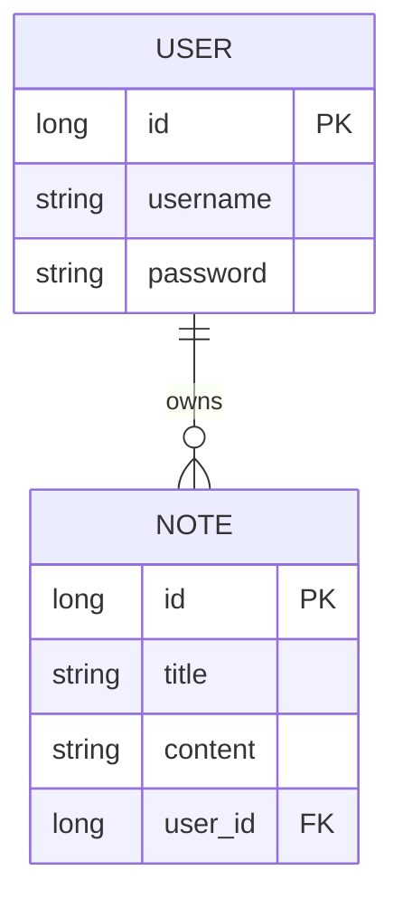

# 📝 NotesApp - Spring Boot Backend

A secure Notes Application built using **Spring Boot**, **Spring Security**, and **PostgreSQL**.

This project demonstrates authentication, authorization, user-based data isolation, and clean layered architecture.

---

## 🚀 Tech Stack

- **Java 17+**
- **Spring Boot 3.x**
- **Spring Security** (Session Based)
- **Spring Data JPA**
- **PostgreSQL**
- **Maven**
- **Thymeleaf** (for Frontend rendering)

---

## 🔐 Features

- **User Registration & Login**: Secure accounts with BCrypt password hashing.
- **Session Management**:  Stateful session-based authentication.
- **CRUD Operations**: Create, Read, Update, and Delete notes seamlessly.
- **Data Isolation**: Users can only access their own notes.
- **Global Error Handling**: Centralized exception management for consistent API responses.
- **Responsive UI**: A clean, mobile-friendly interface.

---

## 🏗 Architecture

The project follows a standard **Layered Architecture** to ensure separation of concerns and maintainability:

1.  **Controller Layer (`/controller`)**: Handles incoming HTTP requests and responses.
2.  **Service Layer (`/service`)**: Contains business logic and transaction management.
3.  **Repository Layer (`/repository`)**: Abstraction layer for database interactions using Spring Data JPA.
4.  **Database**: PostgreSQL for persistent storage.

**Cross-Cutting Concerns:**
- **Security**: Spring Security filter chain handles authentication and authorization before requests reach the controller.
- **Exception Handling**: A global advice component catches exceptions and returns standardized error responses.

---

## 📁 Project Structure

```
src/main/java/com/example/notes
├── config          # Security & Application configuration
├── controller      # REST Controllers (API endpoints)
├── dto             # Data Transfer Objects (Request/Response)
├── exception       # Global Exception Handler & Custom Exceptions
├── model           # JPA Entities (Database Tables)
├── repository      # Data Access Interfaces
└── service         # Business Logic
```

---

## 📡 API Endpoints

### 🔑 Authentication

| Method | Endpoint        | Description |
|--------|----------------|------------|
| POST   | `/auth/register` | Register a new user account |
| POST   | `/auth/login`    | Authenticate and start a session |
| POST   | `/logout`        | Invalidate session and log out |

### 📝 Notes Management

| Method | Endpoint      | Description |
|--------|--------------|------------|
| GET    | `/api/notes`     | Retrieve all notes for the logged-in user |
| GET    | `/api/notes/{id}`| Get a specific note by ID |
| POST   | `/api/notes`     | Create a new note |
| PUT    | `/api/notes/{id}`| Update an existing note |
| DELETE | `/api/notes/{id}`| Delete a note |

---

## 🗄 Database Schema

The application uses a relational database model with two main entities:

### 1. Users Table (`users`)
Stores user credentials and account information.
- `id` (PK)
- `username` (Unique)
- `password` (BCrypt Encrypted)
- `roles` (USER/ADMIN)

### 2. Notes Table (`notes`)
Stores the actual content of the notes.
- `id` (PK)
- `title`
- `content`
- `created_at`
- `user_id` (FK)

### 🔗 Entity Relationships

The relationship between **User** and **Notes** is defined as:

- **One-to-Many**: A single `User` can possess multiple `Note` entries.
- **Ownership**: Each `Note` is linked to exactly one `User`.



---

## 🚀 Getting Started

### Prerequisites

- Java 17 Development Kit (JDK)
- PostgreSQL Database
- Maven

### Installation

1.  **Clone the repository:**
    ```bash
    git clone https://github.com/your-username/NotesApp.git
    cd NotesApp
    ```

2.  **Configure the Database:**
    - Create a PostgreSQL database named `notesdb`.
    - Update `src/main/resources/application.properties` or `application.yml`:
    ```yaml
    spring:
      datasource:
        url: jdbc:postgresql://localhost:5432/notesdb
        username: your_postgres_user
        password: your_postgres_password
    ```

3.  **Build and Run:**
    ```bash
    mvn spring-boot:run
    ```

4.  **Access the App:**
    Open your browser and navigate to: `http://localhost:8080/login.html`

---

## 🧪 Testing

You can test the API using **cURL** or **Postman**.

**Example: Create a Note**
```bash
curl -X POST http://localhost:8080/api/notes \
  -H "Content-Type: application/json" \
  -d '{"title": "My First Note", "content": "Hello World!"}' \
  -b "SESSIONID=your_session_cookie"
```

---

## ⚠️ Security Considerations

- **HTTPS**: Ensure SSL/TLS is enabled in production.
- **CSRF**: Currently disabled for simplicity; enable for production web apps.
- **Input Validation**: Add `@Valid` constraints to DTOs to prevent XSS or bad data.

---

## 👨‍💻 Author

**Vishesh Raj**

---

## ⭐ Why This Project Matters

This project demonstrates:

- Authentication & Authorization
- Secure CRUD operations
- Database relationships (OneToMany)
- Exception handling best practices
- Clean architecture design
- Real-world backend patterns 